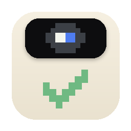
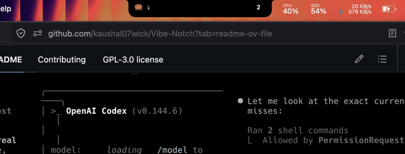
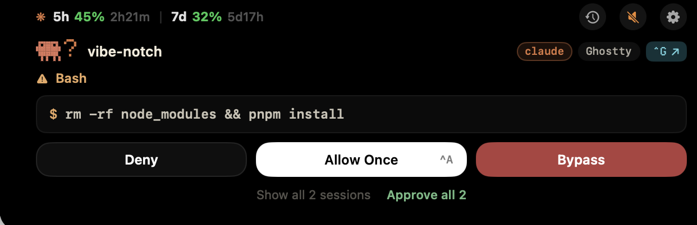
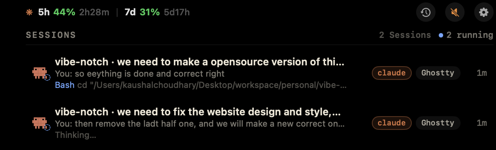

<div align="center">



# Vibe Notch

### Mission control for your AI coding agents — right in the notch.

Stop babysitting terminals. Approve, steer, and watch every agent
from the one place your eyes already go.

[](Package.swift)
[](#build-from-source)
[](#build-from-source)
[](LICENSE)
[](#privacy--security)
[](#contributing)



</div>

---

## The problem

You kick off Claude Code, switch to your browser, and three minutes later the
agent has been sitting on *"Can I run `pnpm install`?"* — waiting, in a buried
terminal tab, while you thought it was working.

**Vibe Notch puts that moment in the notch.** The permission card appears where
you're already looking; one click (or `^A`) and the agent is moving again.

## What you get

| | |
|---|---|
| **Zero babysitting** | Cards pop the instant an agent needs you — and *only* when you're not already looking at its terminal. |
| **Zero misclicks** | Dangerous commands (`rm -rf`, `sudo`, `curl \| sh`) demand **hold-to-approve**. Safe reads auto-approve silently. |
| **Zero context loss** | Jump to the exact terminal tab, reply into the agent's pane, or `^C` a runaway command — from the notch. |
| **Zero cloud** | Native Swift. Local socket. No accounts, no telemetry, no Electron. |

## See it

<div align="center">

**A permission, one glance away** — full command, risk-aware buttons, batch approve:



**Every session, live** — task, your last message, current tool, per-agent pixel marks:



</div>

## Everything else in the box

🔔 **Approve from the notch** — permission cards with the full command, its
diff (for file edits), and Deny / Allow / Bypass. Dangerous commands
(`rm -rf`, `sudo`, `curl | sh`…) require **hold-to-approve** — no reflexive
misclicks.

👀 **Live session board** — every agent session with its task, your last
message, what it's running right now, a rolling console mirror, git branch,
and token usage.

⚡ **Act without switching** — jump to the exact terminal tab (`^G`), type a
reply straight into the agent's pane, or **panic-stop** a runaway command with
a real `^C`.

🕘 **Session history** — click the clock, see past Claude sessions, click one:
a terminal opens running `claude --resume <id>` for you.

🔍 **⌘K palette** — search across active sessions, history, and actions from
one field.

🛡️ **Guardrails** — screen-share guard queues cards silently while you're
presenting; smart suppression skips the popup when the agent's terminal is
already frontmost; per-project policies can lock strict repos to allow-once;
a safe-list auto-approves harmless reads (`git status`, `ls`, …).

📈 **Usage & escalation** — Claude 5h/7d rate-limit windows in the header;
unanswered requests re-chime, badge the menu bar, and (optionally) ping your
phone via [ntfy](https://ntfy.sh).

🧪 **Labs** — localhost web dashboard, notch-over-lock-screen, multi-Mac
monitoring over SSH, and a scriptable CLI
(`vibenotch list|approve|deny|send|interrupt`).

## Supported agents

| Agent | Approvals | Activity | Config |
|---|:--:|:--:|---|
| Claude Code | ✅ | ✅ | `~/.claude/settings.json` |
| Codex | ✅ | ✅ | `~/.codex` (hooks) |
| OpenCode | ✅ | ✅ | plugin, `opencode.json` |
| Qwen · Qoder · Droid · CodeBuddy · Kimi | ✅ | ✅ | Claude-schema / TOML |
| Cursor | — | ✅ | `~/.cursor/hooks.json` |
| Gemini CLI | — | ✅ | `~/.gemini/settings.json` |

Detected agents are wired automatically on first launch; toggle any of them
from the menu bar. Every config edit is backed up and reversible.

## Install

### Download

Grab the latest `VibeNotch-x.y.z.dmg` from
[Releases](https://github.com/kaushal07wick/Vibe-Notch/releases), open it, and
drag **VibeNotch** to Applications.

> Builds are currently ad-hoc signed — on first open, right-click →
> **Open** to pass Gatekeeper.

### Build from source

Requires macOS 14+, Apple Silicon, and the Swift 6 toolchain
(`xcode-select --install` is enough — no Xcode IDE needed).

```bash
git clone https://github.com/kaushal07wick/Vibe-Notch.git
cd Vibe-Notch
./scripts/bundle.sh          # → .build/VibeNotch.app
open .build/VibeNotch.app
```

No Dock icon — look for the notch and the menu-bar item. Detected agents
connect automatically.

### Try it without a real agent

```bash
./scripts/simulate.sh bash     # a Bash approval card (blocks until you decide)
./scripts/simulate.sh notify   # a "waiting" session row
```

## How it works

```
 your agent (Claude Code, …)          VibeNotch.app
 ───────────────────────────          ─────────────
  fires a hook ──► vibenotch-hook ──► unix socket ──► notch card
                   (tiny CLI)         ~/.vibenotch/     │ Approve / Deny
  ◄── decision JSON ◄── blocks on ◄── reply ◄──────────┘
```

- The hook is **fail-open**: if the app isn't running, agents behave exactly
  as they would without Vibe Notch. Nothing is ever blocked by us.
- Local Unix socket only — no TCP, no cloud, no telemetry.
- Answer in the terminal instead? The card notices and dismisses itself.

Full architecture notes live in [`docs/specs/`](docs/specs/).

## Keyboard

| Keys | Action |
|---|---|
| `^A` | Approve the front card |
| `^G` | Jump to the session's terminal tab |
| `⌘K` | Command palette (panel focused) |
| `Esc` | Collapse the panel |

## CLI

```bash
~/.vibenotch/bin/vibenotch list                 # sessions + pending, as JSON
~/.vibenotch/bin/vibenotch approve              # approve the front card
~/.vibenotch/bin/vibenotch send <session> "hi"  # type into that session
~/.vibenotch/bin/vibenotch interrupt <session>  # ^C its foreground process
```

Scriptable from Raycast, cron, or another Mac over SSH.

## Privacy & security

- **Local-first, always.** No accounts, no analytics, no outbound requests
  (the single exception: ntfy phone pings, off by default, to a topic you set).
- Approval decisions are yours: rules written by *Always Allow* live in your
  agent's own config; the safe-list and per-project policies are plain JSON
  under `~/.vibenotch/data` you can audit and edit.
- Screen-share guard keeps commands and prompts off your screen while
  presenting.

## Uninstall

Menu bar → toggle each agent off (restores their original configs), quit the
app, then:

```bash
./scripts/uninstall.sh    # or: rm -rf ~/.vibenotch
```

## Contributing

PRs welcome — this is a community rebuild of a great idea, and the codebase is
deliberately small (Swift package, three targets, no Xcode project).

- `swift build && swift test` must stay green (`./scripts/bundle.sh` for the .app)
- One focused change per PR; match the surrounding style
- Agents are added via a single `AgentSpec` — see [`docs/`](docs/) and
  `Sources/VibeNotchCore/AgentSpec.swift`
- UI changes: attach a before/after screenshot

## License

[GPL-3.0](LICENSE) — free forever, improvements stay open.

## Acknowledgments

- [DynamicNotchKit](https://github.com/MrKai77/DynamicNotchKit) (MIT) — notch
  window, hover, and morph physics
- [Vibe Island](https://vibeisland.app) — the closed-source original that
  inspired this rebuild; [`open-vibe-island`](https://github.com/search?q=open-vibe-island)
  and [boring.notch](https://github.com/TheBoredTeam/boring.notch) for
  mechanism reference
- Departure Mono for the terminal blocks
